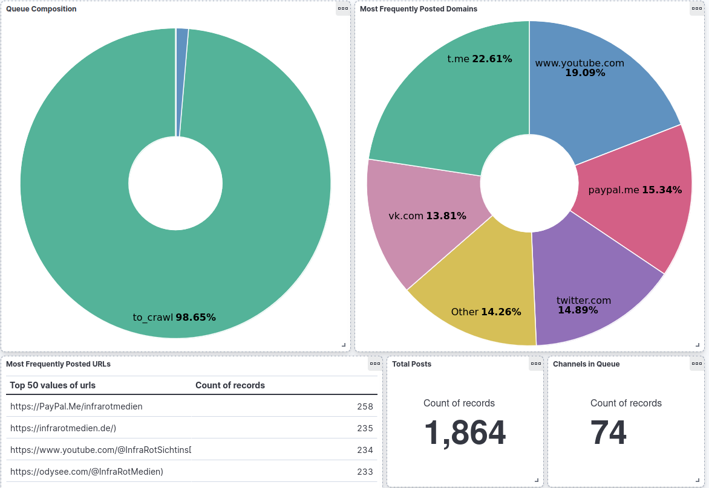

# Telegram Voyager

This is a tool meant to crawl a particular Telegram channel, collect messages and link channels together if they forwarded a message from another channel. This is done using Neo4J and ElasticSearch. It uses Docker to ease the install process and allow it to scale. 

For the visualization aspect Kibana is mainly used, along with the Neo4J browser.

The tool is in two parts:
- Orchestrator: meant to administer at least one Spider, distributing channels to be crawled and collecting messages and information.
- Spider: three Docker containers here to crawl Telegram channels, parse and return the collected information.


This is still being developed, not everything is ready. However, if you wish to test this, please fill the blank passwords in ```.env-orchestrator``` and ```.env-spider```. 

Example of a Kibana dashboard:


---

To test a particular container, you'll most likely need env variable that are set in the .env file. To use it just run `docker run --env-file .env my_docker_image`

You'll need to have a session file to make Telegram requests. Generate it beforehand by running crawler.py locally (after replacing the API_ID and API_HASH values by yours.)


To start the spider, start at the root folder of this repo:

`docker compose -f docker-compose-spider.yaml --env-file .env-spider -p telegram-voyager-spider up --build --force-recreate`

To start the orchestrator, start at the root folder of this repo:

`docker compose -f docker-compose-orchestrator.yaml --env-file .env-orchestrator -p telegram-voyager-orchestrator up`


To inject a channel and start the crawler:

`diag -i infrarotsichtinsdunkel -1001742533871`