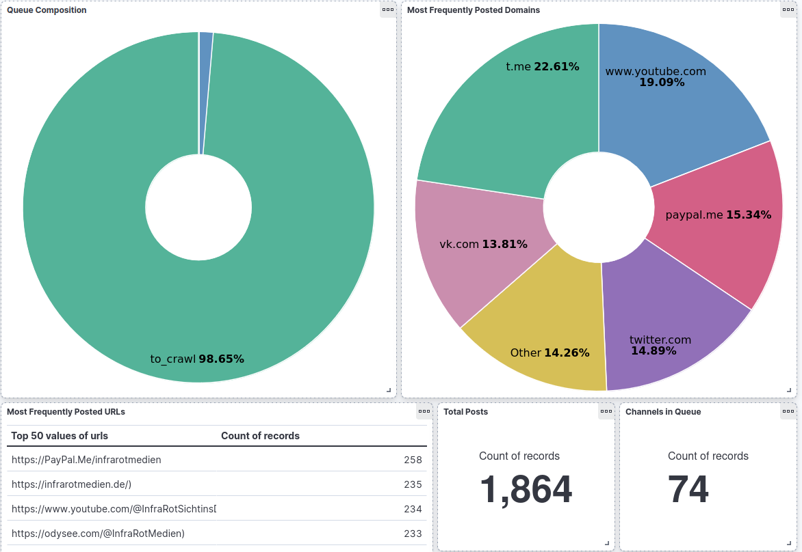

# Telegram Voyager

This is a tool meant to crawl a particular Telegram channel, collect messages and link channels together if they forwarded a message from another channel. This is done using Neo4J and ElasticSearch. It uses Docker to ease the install process and allow it to scale. 

For the visualization aspect Kibana is mainly used, along with the Neo4J browser.

The tool is in two parts:
- Orchestrator: meant to administer at least one Spider, distributing channels to be crawled and collecting messages and information.
- Spider: three Docker containers here to crawl Telegram channels, parse and return the collected information.


This is still being developed, not everything is ready. However, if you wish to test this, please fill the blank passwords in ```.env-orchestrator``` and ```.env-spider```. 

Example of a Kibana dashboard:


---

# Quick start

## 1. Clone the repo
In your machine:
`git clone`

## 2. Configure the .env file
Add your passwords in [.env-orchestrator](.env-orchestrator):

`ELASTIC_PASSWORD=` => `ELASTIC_PASSWORD=mypassword`

`KIBANA_PASSWORD=` => `KIBANA_PASSWORD=mypassword`

`NEO4J_PASSWORD=` => `NEO4J_PASSWORD=mypassword`

It is also recommended you do not use the default `ENCRYPTION_KEY`. See here for [more information](https://www.elastic.co/guide/en/enterprise-search/current/encryption-keys.html)


Add your Telegram information in [.env-spider](.env-spider):

`API_ID=` => `API_ID=<your Telegram API ID>`

`API_HASH=` => `API_HASH=<your Telegram API hash>`

More information on how to [get those here](https://core.telegram.org/api/obtaining_api_id).

## 3. Telegram

You will need to interact with [telegram.py](./spider/spider-crawler/telegram.py) to create a session file that will allow Telegram Voyager to query Telegram. To do so:
1. Install Telethon on your machine (preferably in a venv)
2. Go to the [spider-crawler](./spider/spider-crawler) folder.
```
cd spider/spider-crawler
```
2. Run [telegram.py](./spider/spider-crawler/telegram.py) using the API ID and API hash as argument
```
(.venv) mat@matbuntu:~$ python3 telegram.py <API ID> <API HASH>
Please enter your phone (or bot token): <The phone number associated with this Telegram account>
Please enter the code you received: <Check your Telegram app and enter the code you just received>
Please enter your password: <Paste your Telegram password>
Signed in successfully as <Your Username>; remember to not break the ToS or you will risk an account ban!
```
3. A session file will be created and copied to your Docker container.

## 4. Docker
In the root of the repository:
1. Start the orchestrator: `docker compose -f docker-compose-orchestrator.yaml --env-file .env-orchestrator  -p telegram-voyager-orchestrator up --build --force-recreate`
2. Inject a channel in the queue: `diag -i <channel username> <channel ID>`. Here's how to [find a channel ID and username](#finding-out-a-channel-username-and-id)
3. Start the spider: `docker compose -f docker-compose-spider.yaml --env-file .env-spider -p telegram-voyager-spider up --build --force-recreate`  


# Accessing the data

The Kibana interface can be found on the machine where the orchestrator is running. 
This should be accessible at: http://localhost:5601/. 


---

To test a particular container, you'll most likely need env variable that are set in the .env file. To use it just run `docker run --env-file .env my_docker_image`

You'll need to have a session file to make Telegram requests. Generate it beforehand by running crawler.py locally (after replacing the API_ID and API_HASH values by yours.)


To start the spider, start at the root folder of this repo:

`docker compose -f docker-compose-spider.yaml --env-file .env-spider -p telegram-voyager-spider up --build --force-recreate`

To start the orchestrator, start at the root folder of this repo:

`docker compose -f docker-compose-orchestrator.yaml --env-file .env-orchestrator -p telegram-voyager-orchestrator up`


To inject a channel and start the crawler:

`diag -i infrarotsichtinsdunkel -1001742533871`

---

# Finding out a channel username and ID:

1. Go to the channel
2. Forward a message posted by this channel to the JSON dump bot: https://t.me/JsonDumpBot
3. In the answer, take a look at the following section (particularly the "id" and "username" fields.)
```
"forward_from_chat": {
      "id": -1001742533871,
      "title": "InfraRot - Sicht ins Dunkel",
      "username": "infrarotsichtinsdunkel",
      "type": "channel"
    }
```

